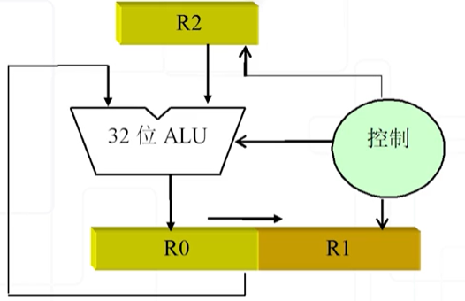
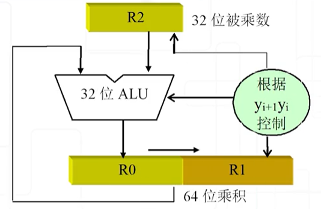

## 2  Representation of Integer

### 2.1  Encoding of Integer

$$
m=X_0X_1X_2...X_n
$$

- Signed magnitude（原码）
  - $X_0$ represent the sign of the integer $m$ (0: *non-negative*, 1: *non-positive*).
  - $X_1X_2...X_n$ is the binary form of $|m|$.
  - As a result, the number 0 has two codes $100...00$ or $000...00$.
  - Not convenient for calculation.
- One's complement（反码）
  - $X_0$ represent the sign of the integer $m$ (0: *non-negative*, 1: *non-positive*).
  - $X_1X_2...X_n$ is the binary form of the number $m$ if $X_0 = 0$;
  - $X_1 X_2...X_n$ is the bitwise NOT of the binary form of the number $-m$ if $X_0 = 1$.
  - As a result, the number 0 has two codes $000...00$ or $111...11$.
  - Not convenient enough for calculation, either.

- Two's complement （补码）

  - $X_0$ represent the sign of the integer $m$ (0: *non-negative*, 1: *non-positive*).

  - $X_1X_2...X_n$ is the binary form of the number $m$ if $X_0 = 0$;

  - $X_1 X_2...X_n$ is 1 plus the bitwise NOT of the binary form of the number $-m$ if $X_0 = 1$.

  - Actually, $X_1X_2...X_n$ is the binary form of the number $(2^n+m)$ if $X_0 = 1$, so $X_0X_1X_2...X_n$ is actually $(2^{n+1}+m)$. That is,
    $$
    [m]_{TC} = [m]_2 \quad (0 \leq m < 2^n) \\ 
    [m]_{TC} = [2^{n+1}+m]_2 \quad (-2^n \leq m < 0)
    $$
    **The two's complement** has the same effect as *mod $2^{n+1}$*.

  - As a result, the number 0 only has one code $000...00$.
  - $[X + Y]_{OC} = [X]_{OC} + [Y]_{OC}$

> [*Example*] (different encoding methods in computer) 
> $$
> [-102]_{10}=[11100110]_{S} = [10011001]_{OC}=[10011010]_{TC}
> $$
> where $S$ stands for *Signed magnitude*, $OC$ stands for *One's complement* and $TC$ stands for *Two's complement*.
>
> So $-102$ has the code of $10011010$ in two's complement, as a result, it is stored as $[9A]_H=[9A]_{16}$ in computer. 

> [*Example*] The encoding method of *int* in the computer is *two's complement*.
>
> $[100...00]_{TC} = -2147483648 = -2^{31}, [011...11]_{TC}=2147483647$, so the range of *int* in computer is $[-2147483648, 2147483647]$.

### 2.2  Encoding of Unsigned Integer

$$
m = X_0X_1X_2...X_n
$$

The range is $[0, 2^{n+1}-1]$, it is also same as *mod $2^{n+1}$*.

The two's complement of a signed number can also be regard as a unsigned number, which means the code does not change! But the meaning of the code changes, a negative number becomes a quite big positive number.

> [*Example*] **Warning** In C compiler, if the two operands are a signed number and an unsigned number, the signed number will be implicitly transformed to unsigned number.
>
> ```C++
> unsigned int length = 0;
> for (int i = 0; i <= length - 1; ++ i)
> 	// do something ...
> ```
>
> In the program above, `length` is an unsigned number while `i` and `1` are a signed number, the compiler will automatically transform `1` to unsigned number, and calculate `length - 1` which is `0-1` in unsigned number, so the result will be $2^{32}-1$, which is the maximum number of *unsigned int*. The comparison between `i` and `length - 1` will also be treated as unsigned number comparison, so the loop will never end because all the *unsigned int* number is not greater than $2^{32}-1$.

How to use *unsigned* in programming?

- Use *unsigned int* to represent set (subset).
- Use *unsigned int* as a modulo system.

### 2.3  Bitwise Operators

Operator `&`, `|`, `^`, `~`, `<<`, `>>` in C language are bitwise operator. They can fully use the feature of the binary number. Here are some useful methods to use the bitwise operator:

- Masking（掩码）：Use operator `&` to extract some certain digit of an number:

  > [*Example*] `0x8C & 0x0F = 0x0C` extract the digit `C`; `0x238C & 0x0FF0 = 0x0380` extract the digits `38`.  

- Set or check in certain digits: Use operator `&` or `|` to set 1 or 0 in some certain digit, or check if certain digit is 0 or 1.

  > [*Example*] `0x0C | 0xF0 = 0xFC`; `0x238C & 0x0FFF = 0x038C`;
  >
  > Check if the last binary digit of `x` is 1: `x & 1`.

- Represent a set: The $i$-th binary digit represent whether $p_j$ is in the set. The `&` operator can be used to get the *intersection* of two sets; the `|` operator can be used to get the *union* of two set; the `^` operator can be used to get the *symmetric difference* of two sets.

  > [*Example*] $\{1,2,4,6\}$ can be represent as `01010110`, $\{1,3,5\}$ can be represent as `00101010`; `01010110 & 00101010 = 01111110` represent $\{1,2,3,4,5,6\} = \{1,2,4,6\} \cup \{1,3,5\}$.

- Digit-extension（位扩展）: the C programming language will do it automatically, after the extension, the number **WILL NOT** change.

  - 0-extension（0扩展）: the transformation of unsigned numbers, all the extension digit will be filled with 0.
  - signed-extension（带符号扩展）: the transformation of signed numbers, all the extension digit will be filled with the sign digit of the original number.

  > [*Example*]
  >
  >  `(unsigned short)111...11 = (unsigned int)000..00111...11` 
  >
  >  `(short)011...11 = (int)000...00011...11`
  >
  >  `(short)111...11 = (int)111...11111...11`

- Digit-truncation（位截断）: the C programming language will do it automatically. Force to truncate, so the meanings may be different.

  > [*Example*]
  >
  > ```c++
  > int i = 32768;
  > short j = (int) i;
  > int k = (short) j;
  > ```
  >
  > Both `i` and `j` have code of `0x8000` in the two's complement, which represent the number of  `-32768` in *signed short*. When cast to *int* again, the number is still `-32768` according to the digit-extension rules, that is, `k` have a code of `0xFFFF8000` in the two's complement, which is different from original number `32768`.

- Shift-truncation（移位）: the C programming language has the operator `<<` and `>>`.

  - Left-shift（左移）: throw away the high digits, and filled the low digits with 0. Usually, `x << 1` has the same effect as `x * 2`. Left-shift may cause overflow and get the wrong result.

  - Right-shift（右移）: throw away the low digits, and filled the high digits with 0 (logic right-shift（逻辑右移）); or throw away the low digits, and filled the high digits with the sign digit of original number (arithmetic right-shift（算术右移）). Just like digit-extension, compiler will automatically choose one of the methods. Similarly, `x >> 1` has the same effect as `x / 2`.

  - **Warning**: In the shift operator `x << y` or `x >> y`, if `y` is greater than the digit-length of `x`, then the C compiler / MIPS will automatically do the modulo operation in `y`.

    > [*Example*] If the `x` has 32 digits, the result will be `x >> (y%32)`.

### 2.4  Logic Operators

Logic Operators `&&`, `||`, `!` only get the result *true* (not 0) or *false* (0).

> [*Example*] Short-circuit evaluation in logic operator: `true || p == 1`, we don't need to check if `p==1`, we can get the result is `true`.

**The Comparison between Logic Operators and Bitwise Operators**:

- Logic Operators: only has *true* or *false*, don't care about the actual numbers.
- Bitwise Operators: are operations between actual numbers.

### 2.5  The +/- Operators

Suppose the digit numbers of the operands are $w$.

**Unsigned Addition Operation**

Unsigned addition operation is same as addition operation under modulo $2^w$, that is,
$$
UAdd_w(u,v) = (u+v) \ mod\ 2^w
$$
**Signed Addition Operation (TC)**

According to the addition formula in two's complement, we still have:
$$
TAdd_w(u,v) = (u + v)\ mod\ 2^w
$$
> That means, in the following program, `sum1` is equal to `sum2`.
>
> ```c++
> int u, v;
> int sum1 = (int)((unsigned int)u + (unsigned int v);
> int sum2 = u + v;
> ```
>
> **Explanation** *The numbers are the same, only the ways we look at the numbers change.*

**Serial Carry Adder**

So the *addition operation* can be implemented with many **1-bit Full Adder**s（一位全加器）.


where, *A* and *B* are operands, *carry_in* is the carry of lower digits, *carry_out* is the carry of higher digits, *S* is the result of this digit.

We can have:

```c++
S = A ^ B ^ carry_in
carry_out = (A & B) | (A & carry_in) | (B & carry_in)
```

With many *1-bit full adders* connected together, we get a **serial carry adder** (simple but slow).

**Unsigned Subtraction Operation**

Unsigned subtraction operation is same as substract operation under modulo $2^w$, that is,
$$
USub_w(u,v) = u - v = u - v + 2^w = u + (2^w - v) = u + \bar{v} + 1
$$
**Signed Subtraction Operation (TC)**

According to the addition formula in two's complement, $[A - B]_{TC} = [A + (-B)]_{TC} = [A]_{TC}+[-B]_{TC}$. And we know that $[B]_{TC} + [-B]_{TC} = 0$, so we have $[-B]_{TC} = 0 - [B]_{TC} = \overline{[B]_{TC}} + 1$.
$$
TSub_w(u,v) = u-v = u + \bar{v} + 1
$$
**Arithmetic/Logic Unit**

Thus, we can design a *serial carry adder-subtracter* （串行加减法器） in the following structure.

When doing addition operation, the signal `add/sub` is `0`; when doing subtraction operation, the signal is `1`.


We use a *xor-gate* to implement the bitwise NOT operation in the subtraction.

This unit can also do other logic/arithmetic things, so we call it **ALU** (**Arithmetic/Logic Unit**).

### 2.6  Overflow

**Overflow**: the result of operation is out of the range of number.

Two number with the opposite sign in addition operation or two number with the same sign in subtraction operation **CAN NOT** cause *overflow*. Only two number with the same sign in addition operation or two number with the opposite sign in subtraction operation **MAY** cause *overflow*.

| Operation | Operand A | Operand B  | Overflow Result |
| --------- | --------- | ---------- | --------------- |
| C = A + B | $A\geq 0$ | $B\geq 0$  | $C < 0$         |
| C = A + B | $A<0$     | $B<0$      | $C\geq 0$       |
| C = A - B | $A\geq 0$ | $B < 0$    | $C < 0$         |
| C = A - B | $A < 0$   | $B \geq 0$ | $C \geq 0$      |

**How to check if overflow happens?**

- Check the sign digit: suppose the highest digit number is 31 ($n = 32$).

  

  ```c++
  Overflow_Sign = (A31 & B31 & (~ S31)) | ((~ A31) & (~ B31) & S31);
  Overflow_Sign = (A(n-1) & B(n-1) & ~ (S(n-1))) | (~ (A(n-1)) & ~ (B(n-1)) & C(n-1));
  ```

- Check the carry of the highest digit $c_{n-1}$ and the carry of the second-highest digit $c_n$.

  - If $c_{n-1} = c_n$, then **NO** overflow.
  - If $c_{n-1} \ne c_n$, then **OVERFLOW**.

  $c_{n-1}$ is the carry_in of $(n-1)$ digit and  $c_n$ is the carry_out of $(n-1)$ digit. 

  P.S: We count the digit from 0 to $(n-1)$.

  So we can add a *xor-gate* between carry_in and carry_out of the digit $(n-1)$, that is,

  ```
  Overflow_Sign = carry_in(n-1) ^ carry_out(n-1);
  ```

- Double sign-digit. Extend the sign digit to 2 digits, and use `00` to represent positive and `11` to represent negative. Then if the result's sign digits are `01` or `10`, overflow happens.

### 2.7  The * Operator

**Multiplication Operation with Signed magnitude **

When consider only one digit, we can use an *and-gate* to get the answer simply, so we can use *ALU* and *and-gate* to implement the multiplication operation.

> We can also design a more specific circuit to finish the task.
>
> - If the last digit of R1 is 0, do nothing (R0 plus 0)
> - If the last digit of R1 is 1, then set R0 to R0 plus R2.
>
> After addition operation end, do the *right-shift* to R0 and R1.
>
> **NOTE**: when doing *right-shift*, treat R0 and R1 as a total!
>
> 

With the method above, we can design a circuit to do 32-bit multiplication operation of signed magnitude.



**NOTE**: the sign digit is **NOT** involved in the calculation above!

**Multiplication Operation with Two's Complement**: <font color=red>**Booth Algorithm**</font>

With the method above, we use the last two digit of R1 to control the operation:

- If the last two digit of R1 $y_{i+1}y_i$ is 00 or 11, do nothing.
- If the last two digit of R1 $y_{i+1}y_i$ is 01, then set R0 to R0 plus R2.
- If the last two digit of R1 $y_{i+1}y_i$ is 10, then set R0 to R0 minus R2.

We can use the same structure above to complete the multiplication operation.



> **Correctness Proof**
>
> Suppose $[x]_{TC}=x_n x_{n-1} ... x_1x_0, [y]_{TC}=y_n y_{n-1} ... y_1y_0 $, then
> $$
> result = (0 - y_0)x\times 2^0 + (y_0 - y_1)x \times 2^1 + (y_1 - y_2)x\times 2^2 + ... +(y_{30} - y_{31})x \times 2^{31}
> $$
> So,
> $$
> result = x(-y_{31}\times 2^{31} + y_{30}\times 2^{30}+y_{29} \times 2^{29} + ... + y_0 \times 2^0)
> $$
> $y_{31}$ is the sign digit of $y$, so whether $y$ is positive or negative, we have:
> $$
> y = (-y_{31}\times 2^{31} + y_{30}\times 2^{30}+y_{29} \times 2^{29} + ... + y_0 \times 2^0)
> $$
> As a result, $result = xy$, the algorithm is correct!

Suppose the digit numbers of the operands are $w$.

**Unsigned Multiplication Operation**

Unsigned multiplication operation is same as multiplication operation under modulo $2^w$, that is,
$$
UMult_w(u,v) = (u\cdot v)\ mod\ 2^w
$$
**Signed Multiplication Operation (TC)**

We can find that the formula still works:
$$
Tmult_w(u,v) = (u \cdot v)\ mod \ 2^w
$$
**Compiler Optimization in Multiplication Operation**

Use `<<` or `>>` and `+` or `-` to optimize:

> [*Example*] The following code can be optimized.
>
> ```C++
> long mul12(long x) {
> 	return x * 12;
> }
> ```
>
> After compiling with optimization, we can get:
>
> ```assembly
> leaq (%rax, %rax, 2), %rax
> salq $2, %rax
> ```
>
> which means:
>
> ```c++
> t = x + x * 2;
> return (t << 2);
> ```

**Overflow**

The multiplication operation usually **DO NOT** have an overflow-check feature, and the compiler **MAY NOT** check the overflow problem of multiplying.

