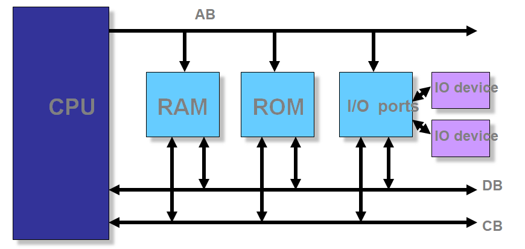
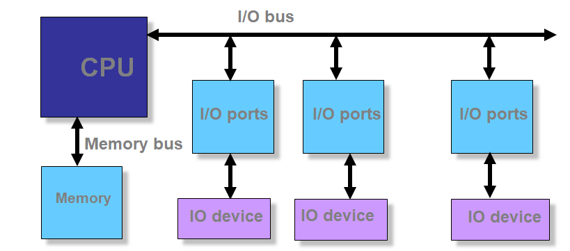
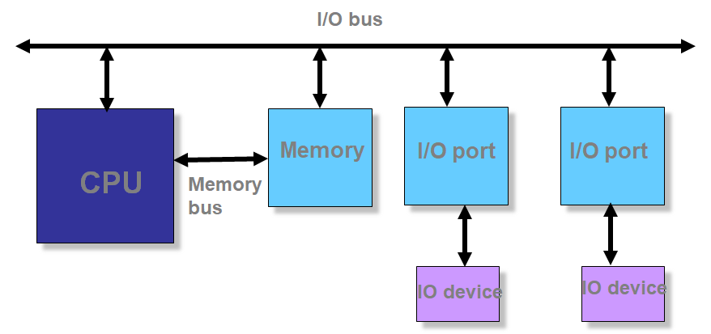
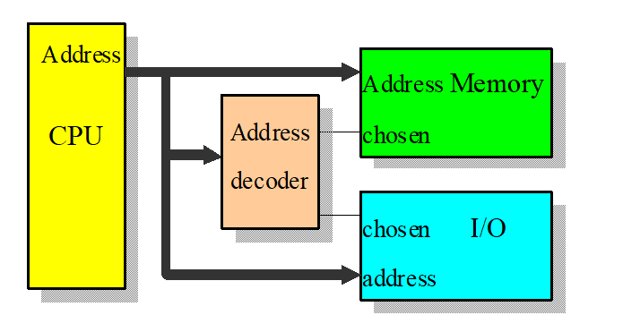
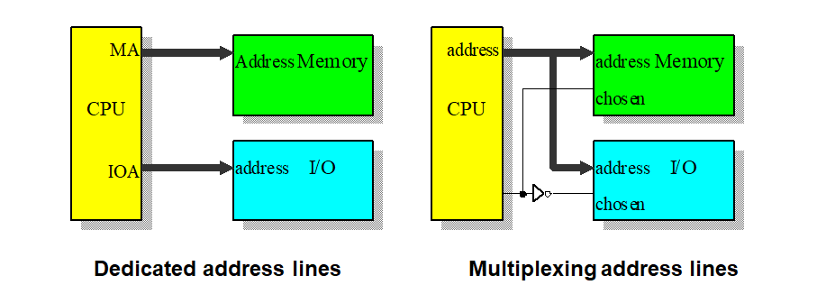

## 1  Introduction

### 1.1  Course Introduction

**Definition (Abstraction)**  The process of removing physical, spatial, or temporal details or attributes in the study of objects or systems in order to focus attention on details of higher importance, it is also very similar in nature to the process of generalization.

**This COURSE teaches**: Programming Interface & Computer Organization.

### 1.2  Computer Organization

**Von Neumann Architecture** consists 3 main components:

- Input, Output  (I/O devices)
- Memory  (Memory)
- Arithmetic/Logic Unit, Control Unit  (CPU, Central Processing Unit)


> *Example*: How does a C program run in the Von Neumann Architecture?
>
> ```C
> # include "stdio.h"
> int main() {
> 	int x, y, z;
> 	scanf("%d%d", &x, &y);
> 	z = x + y;
> 	print("%d\n", z);
> 	return 0;
> }
> ```
>
> 1. Load the program in the *Memory Unit*.
> 2. *Control Unit* go through each statement sequentially:
>    1. Read the input numbers $x$ and $y$ from the *Input Devices* into the *Memory Unit*.
>    2. The *Arithmetic/Logic Unit* calculate the $x + y$, and store the result $z$ in the *Memory Unit*.
>    3. Print the output number $z$ to the *Output Device*.

**Key Abstractions of Von Neumann Architecture**

- Data: Both instructions and data are stored in a *single* read-write memory.
- Instruction: The contents of memory are *addressable* by location, without regard to the type of data.
- <font color = red> Sequential execution model </font>

> *Example*: The C programming language is just a higher level abstraction of Von Neumann architecture.
>
> - Data  $\longleftrightarrow$  Variable
> - Instruction $\longleftrightarrow$ statement/code
> - Sequential execution model $\longleftrightarrow$ Sequential execution model (*in C programming language*)
> - More abstractions in C programming languages: function calls etc. 

Interactions between the components and abstractions:

- Data and instructions are stored in the memory.
- CPU executes instruction in sequential order.
- Instruction can read and write memory.
- Instruction can perform arithmetic operations.

> *Example*: Another architecture: Harvard Architecture.
>
> 
>
> Harvard architecture separates Instruction Memory and Data Memory.
>
> **Advantages of Harvard Architecture**
>
> - Efficient Pipelining - Operand Fetch and Instruction Fetch can be overlapped.
>
> - Separate Buses for data and instructions.
>
> - Tailored towards an FPGA implementation.
>
> **Disadvantages of Harvard Architecture**
>
> - Not widely used.
>
> - More difficult to implement.
>
> - More pins.

**Microcomputer**

- **CPU**: processes information stored in the memory.

- **Memory**: stores both instructions and data.

- **Input/Output ports**: provide a means of communicating with the CPU.

- **BUS**: (*wires*) interconnecting all parts together. (Address bus, Data bus, Control bus)

  

**Microcomputer System**

- Microcomputer
- Peripheral I/O devices

- **Software**
  - System Software: Interacting with hardware, such as OS, compilers, drivers.
  - Application Software: Interacting with users, such as Word, Excel, MATLAB.


### 1.3 CPU (Microprocessor)

> 4 layers of CPU structure:
>
> - <font color=red>Instruction Set Architecture (ISA)</font>
>
> - Logical Gate
>
> - Transistor
>
> - Sand

**Key concepts of CPU**

1. **Core(s)** (each core includes ALU, CU, register) (*2005 - now: multicore*)
2. **Clock**
3. **ISA** (Intel x86/ARM/MIPS/RISCV)

**ALU**: multifunctional calculator. 

- Arithmetic functions (add, substract, ...) and Logic functions (AND, OR, ...).

- Two inputs.
- Calculation result can be temporarily stored in one of registers.

**Instruction**: a pre-defined code which defines a specific operation, processing and exchanging information among CPU, memory and I/O devices.

**CU**: works under *instruction*, contains an *instruction decoder* and *program counter*.

- *instruction decoder*: decodes an instruction and generates all control signals.
- *program counter*: points to the address of the next instruction to be executed.

**IS: Instruction Set**

- *CISC: Complex Instruction Set Computer*: friendlier to programmer.
  - Variable instruction length (1 ~ $n$ words)
  - Variable execution time of different format instructions.
  - More instruction formats.
  - Upwardly compatible (new instruction set contains earlier generation's instruction)
- *RISC (Reduced Instruction Set Computers)*: easier to implement.
  - Fixed size (1 word).
  - Fixed time for all instructions.
  - Easy to pipeline in RISC instructions (fast)
  - Fewer formats (simple hardware, shorter design cycle)

### 1.4 Memory

> [*Definitions*]
>
> **Bit**: a binary digit that can have the value 0 or 1;
>
> **Byte**: consists of 8 bits - smallest unit that can be addressed in microcomputers. (*CPU-independent, universal*)
>
> **Nibble**: is half a byte (4 bits).
>
> **Word**: the number of bits that a CPU can process at one time. It is depends on the width of the CPU's registers and that of the data bus. (*CPU-dependent*)
>
> **Double word**: double word.
>
> **Kilo($2^{10}$), Mega($2^{20}$), Giga($2^{30}$), Tera($2^{40}$), Peta($2^{50}$) - Bytes**

**Memory Module Organization**

- If the module needs bigger unit of transfer than that of given memory chips, *bit extension*;

- If the module needs larger number of words than that of given memory chips, *word extension*.

**Memory Hierarchy**

- Cache;
- Primary memory: ROM, RAM;
- Secondary memory: magnetic disk, optical memory, tape, ...

### 1.5 Bus

**Bus** is a communication pathway connecting two or more devices.

- A *shared* transmission medium: *one device at a time*.
- **System bus**: connects major computer components (processor, memory, I/O).
- **Arbitration**: When there are multiple devices that want to send signal, the arbitration will decide which device will have the right.
  - Distributed: each module has access control logic and collaborate.
  - Centralized: *bus controller* responsible for allocating time on a bus.
- **Type**: *Dedicated* or *Multiplexed*.
- **Timing**:
  - Synchronous: events on the bus is determined by a global clock, a single 1-0 transmission is referred to as a *bus cycle*.
  - Asynchronous: devices have their own clocks and communicate before and after an event.

**Single-bus Structure**

- A bus connects all modules.
- Simple but have poor performances in terms of *throughput*.



**CPU-Central Dual-Bus Structure**

- A dedicated bus between CPU and memory, and a dedicated bus between CPU and I/O devices.
- efficient in terms of data transfer, but poor CPU performance (All the data will go through CPU).



**Memory-Central Dual-Bus Structure**

- Gain both High CPU performance and data transfer throughput.



Data Bus**

- Used to provide a path for moving data between system modules.
- **Bidirectional**
  - CPU read: Memory $\rightarrow$ CPU;
  - CPU write: CPU $\rightarrow$ memory.
- The width of data bus is as wide as the registers of a CPU (the *word* length).

**Address Bus**

- Used to designate the source or destination of the data on the data bus that the processor intends to communicate with.

- **Unidirectional**: *only* CPI $\rightarrow$ memory or I/O device.

- The width of address bus $n$ determines the total number of memory locations addressable by a given CPU, which is $2^n$.

  > [*Example*] *Pentium* has 32-bit address bus, then it has $2^{32}$ bytes (or 4GB) addressable memory.

**Control Bus**

- Used to control each module and the use of data and address buses. Mainly used to send the command signal.
- **Two sets of unidirectional control signals**
  - *Command signal*: CPU $\rightarrow$ Memory or I/O device
  - *State signal*: memory or I/O device $\rightarrow$ CPU

### 1.6 I/O

**Memory-mapped I/O**

- One single address space for both memory and I/O;
- Status and data registers of I/O modules are treated as memory locations;
- Using the same machine instructions to access both.



**Isolated I/O**

- Two separate address spaces for memory and I/O modules;
- Using different sets of accessing instructions.



**Essential difference** between *memory-mapped I/O* and *isolated I/O*: The CPU is aware of which part they are trying to access, memory or I/O device.

### 1.7 Embedded System

**Microcontroller**

A microcontroller has a CPU in addition to a fixed amount of RAM, ROM, I/O ports on one single chip. Microcontroller is ideal for applications in which cost and space are critical.

> [*Example*] A TV remote control does not need the computing power of a 486.

**Embedded System**

An embedded system uses a **microcontroller** or a **microprocessor** to do *one task and one task only*.

- Using microcontrollers is cheap but sometimes inadequate for the task；

- Microcontrollers differ in terms of their RAM, ROM, I/O sizes and type.

