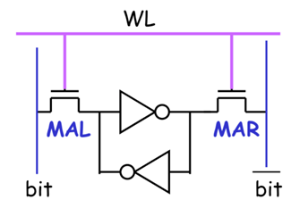
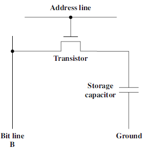
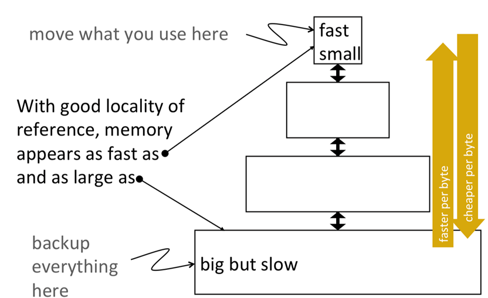

## 2 Memory and I/O Modules

### 2.1 Memory Taxonomy & Characteristics

**Physical Types of Memory**

- Semiconductor（半导体介质）: RAM & ROM;
- Magnetic（磁介质）: Disk & Tape;
- Optical（光介质）: CD & DVD.

**Location**

- The memory in CPU: *registers*.
- The internal memory: *cache*, *main memory*.
- The external memory: *disks, CD and DVD*.

**Capacity**

- *Word size*: The natural unit of organization (this 'word' is defined in memory field).

- Number of words

  > [*Example*] 
  >
  > Memory A have a word size of 8-bit and have 2M words.
  >
  > Memory B have a word size of 1-bit and have 16M words.
  >
  > Memory A and Memory B have the same capacity.

**Unit of Transfer**

- Internal: usually a word, governed by the data bus width;

- External: usually a block which is much larger than a word.

  > [*Example*] The CPU can calculate one addition every cycle, but a memory transfer takes two cycles. That is,
  >
  > Memory: 0.5 words/cycle
  >
  > CPU: 2 words/cycle  (calculation)
  >
  > With the memory interface width to be 4 words, the CPU can be kept with 100% utilization.

**Addressable unit**

- Smallest location which can be uniquely addressed.
- Normally a byte for internal memory;
- *Cluster of disks*.

**Access Methods**

- **Sequential**: Access start at the beginning and read through in order. Access time depends on location of data and previous location. (*tape*) (**NO address**)
- **Direct**: Individual blocks have unique address. Access is by jumping to vicinity plus sequential search. Access time depends on current location and destination location. (*disk*) (**HAVE address**)
- **Random**: Individual addresses identify locations exactly. Access time is independent of location or previous access. (*ROM*, *RAM*) (**HAVE address**)
- **Associative**: Data is located based on a portion of its contents rather than its address. Access time is independent of location or previous access. (*cache*) (**HAVE address**, but using contents to find location)

**Performance Metrics**

- Access time: time between presenting the address and getting the valid data.

- Memory cycle time: time may be required for the memory to "recover" before next access. It 

  > [*Example*] When we access the data in *DRAM*, we destroy the data, so we have to restore ("recover") the data in *DRAM*.

- Transfer rate: rate at which data can be moved. (unit: transfer per second)

- Transfer bandwidth: equals to transfer rate * transfer unit size (unit: bytes per second)

> [*Example*] A memory transfer takes two cycles and each transfer has 4 bytes. Clock frequency is 1GHz.
> $$
> A.T. = 2\ \mathrm{cycles} = 2\ \mathrm{ns} \\
> T.R. = 0.5\ \mathrm{T/cycle} = 0.5\ \mathrm{GT/s}\\
> T.B. = 0.5\ \mathrm{GT/s} \times 4\ \mathrm{B/T} = 2\ \mathrm{GB/s}
> $$

**Memory Basics**

- **RAM**: Random Access Memory.
  - Read/Write;
  - Temporary storage: when the power is gone, the data will be lost;
- **ROM**: Read-Only Memory.
  - The writing process of this kind of memory is much harder than reading, often requiring some external help.
  - No capabilities for "online" memory write operations.
  - Both RAM and ROM are made by *semiconductors*.

- Volatility of Memory（易失性）
  - Volatile memory loses data over time or when power is removed. (*RAM*)
  - Non-volatile memory stores date even when power is removed. (*ROM*)
  - **Static**: holds data as long as power is applied. (*SRAM*)
  - **Dynamic**: will lose data unless refreshed periodically. (*DRAM*)

**Static RAM**

- The cycle of inverters keep the data running.
- As long as the power is on, the data is stored.
- When we want to read the data, open MAL; when we want to write the data, open MAL and MAR, and write the data through MAL (need some time).
- 6T-SRAM (6-transistors, MAL, MAR, and 2 transistors in each inverter).

**Dynamic RAM**

- Simpler construction;
- Need refresh circuits; slower;
- Consume less transistor (only 1 transistor), less expensive;
- Need 'recovery' part (after reading operation, the data will be lost).

### 2.2 Memory Hierarchy in Computer System

**Memory Hierarchy** (Registers, L1 Cache, L2 Cache, Main memory, Disk, Optical, Tape).

**Why Memory Hierarchy?**

- Bigger (capacity) is slower.
- Faster is more expensive.

**Idea Behind Memory Hierarchy**

### 2.3 RAM Organization

### 2.4 Memory Module Extension

